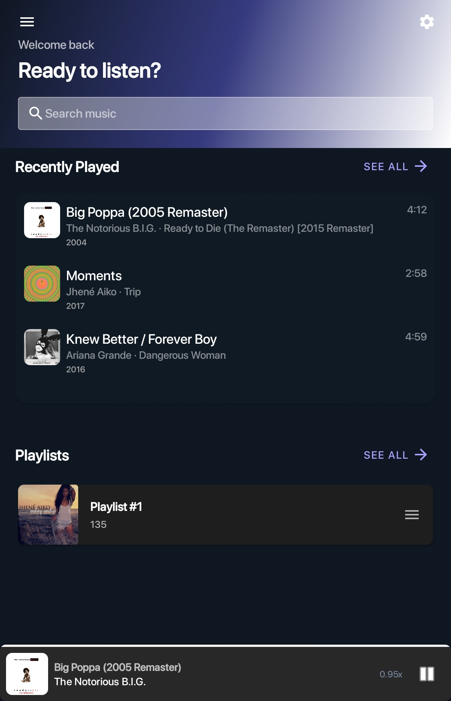
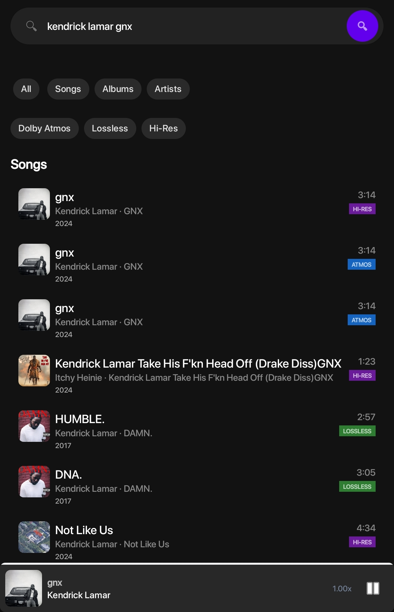
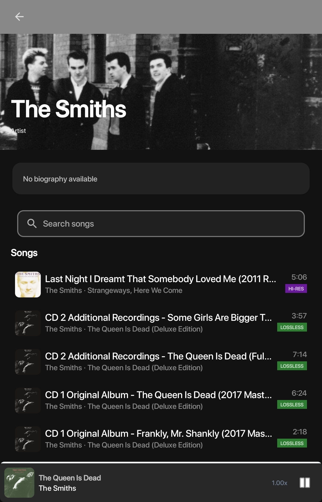
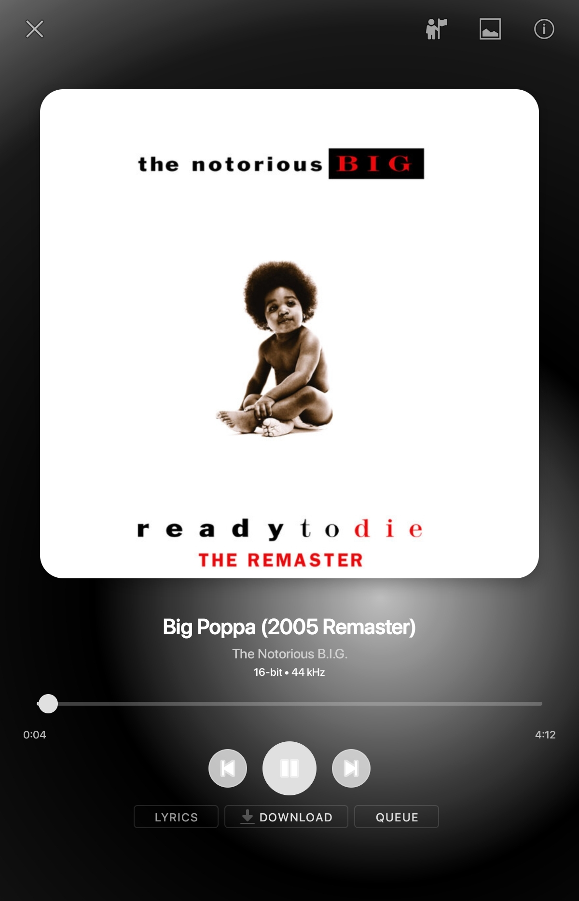
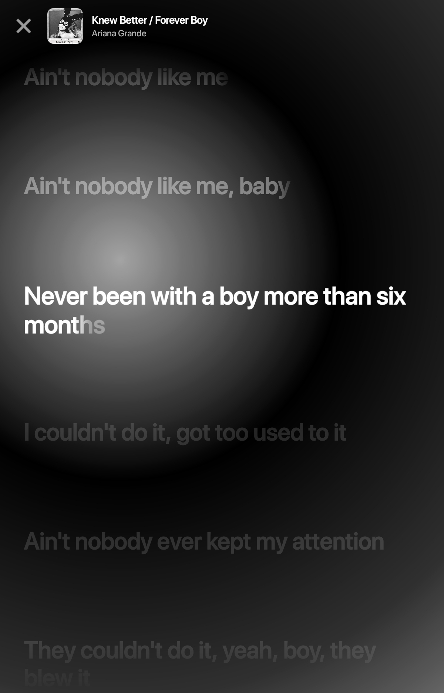

     
This is of version 1.3.0. **UI is subject to change. and UI has changed since 1.3.0 (as I am writing this, version 1.4.0 has been published.)**

Moniq, a OpenSubsonic client which supports servers that use legacy authentication. 

Moniq does not in any way take responsibility for any 3rd party sources/links used. Any complaints should be taken up with the 3rd party source themself.

—————— ——— ——— ——— ——— ——— ——— ——— ——— ———

Moniq supports:
Importing playlists from Spotify via a CSV file provided by https://exportify.net

Last.fm scrobbling (automatically cleanses double artists e.g The Weeknd, Ariana Grande only gets counted as The Weeknd)

Slowing/speeding up songs with pitch also being changed

Being able to download the files from your library

Playlist support with shuffle 

——————— ——— ——— ——— ——— ——— ——— ——— ——— ——— ——— ———
