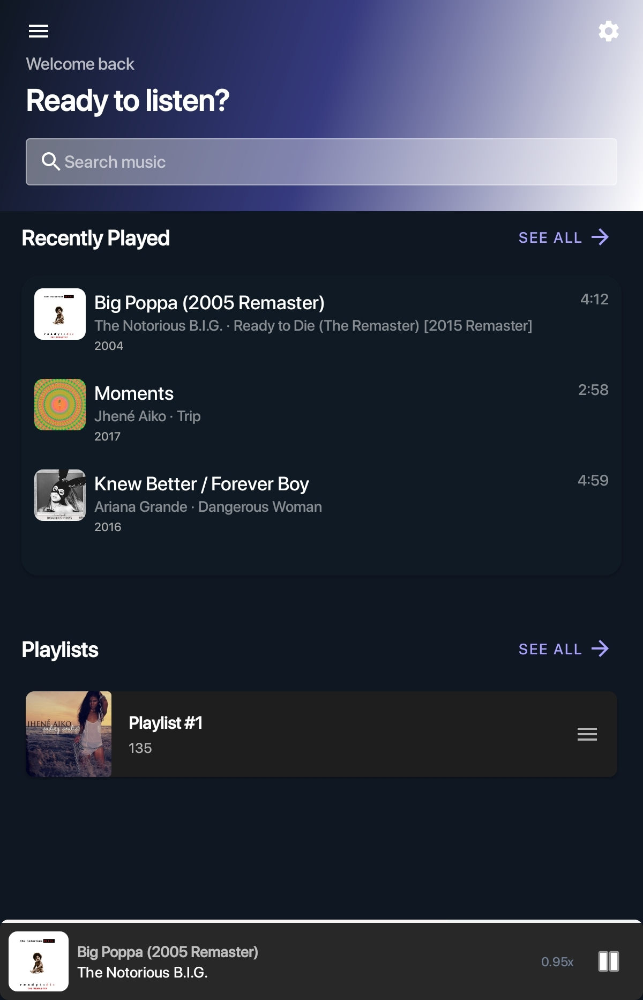
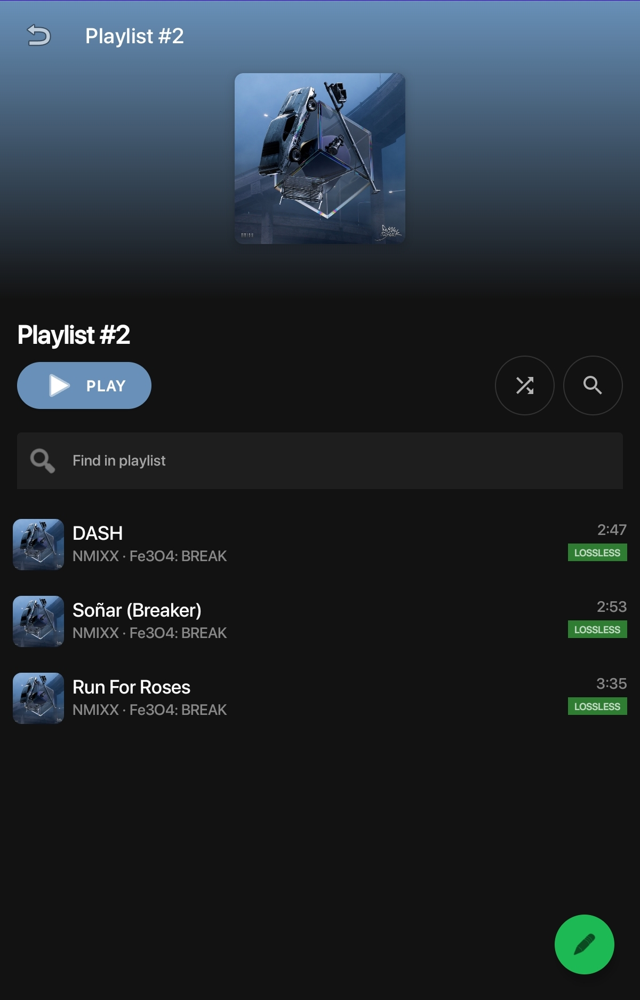
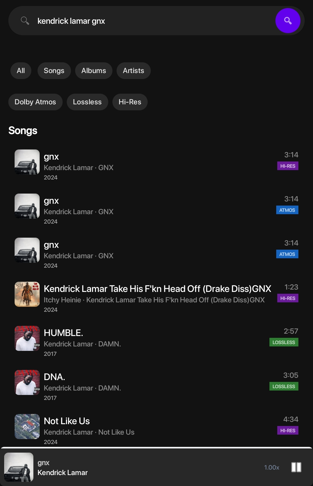
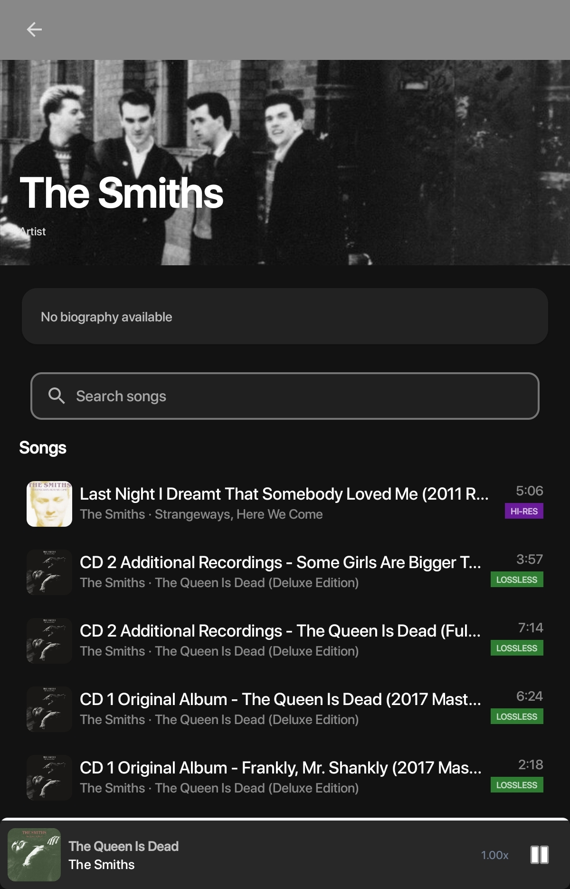
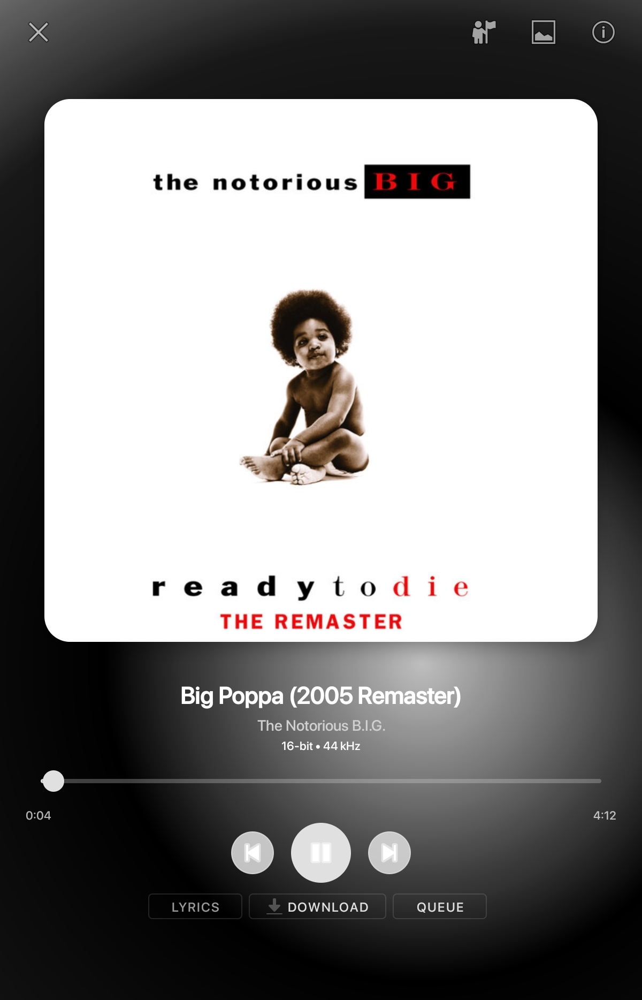
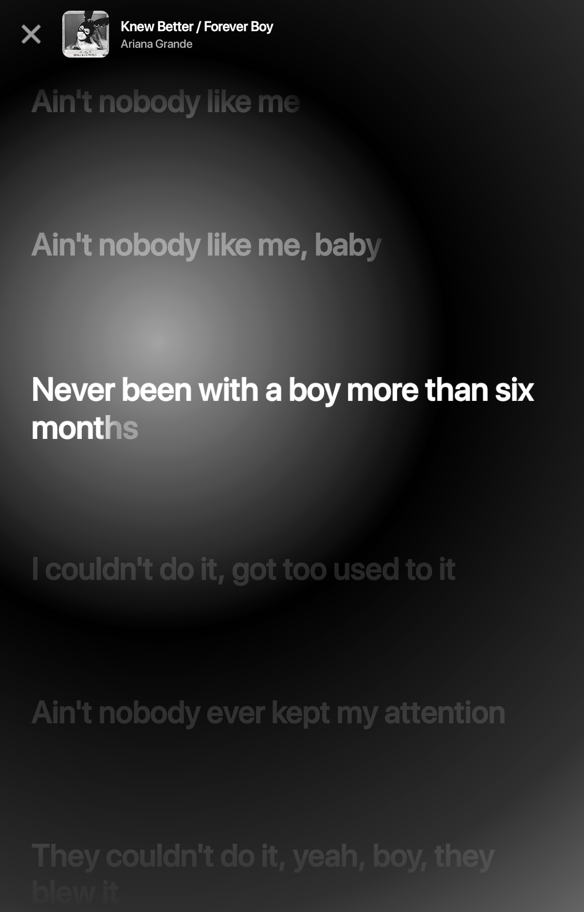

      
This is of version [1.5.7](https://github.com/theherta0000-cell/Moniq/releases/tag/v1.5.7). **UI is subject to change but has not changed since this version**

Moniq, an Android solution to streaming.
Moniq no longer supports OpenSubsonic streaming. However, you can still download the fully functional latest version that supported it from [here (1.4.0)](https://github.com/theherta0000-cell/Moniq/releases/tag/v1.4.0).

Moniq does not in any way take responsibility for any 3rd party sources/links used. Any complaints should be taken up with the 3rd party source themself.

—————————————————————————————————

Moniq supports:
Importing playlists from Spotify via a CSV file provided by https://exportify.net

Exporting playlists for saving reasons or to transfer to another device

Last.fm scrobbling (automatically cleanses double artists e.g The Weeknd, Ariana Grande only gets counted as The Weeknd)

Slowing/speeding up songs with pitch also being changed

Being able to download music files with metadata embedded into it, if it is in the LOSSLESS quality format

Playlist support with shuffle 

Lyrics support

A recently played section to quickly get back to listening to your favourite tracks

—————————————————————————————————

